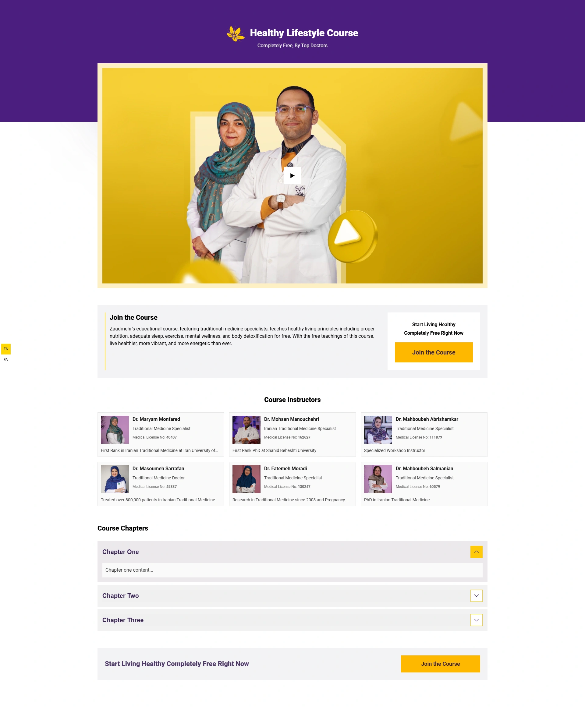
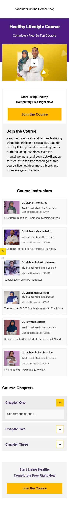
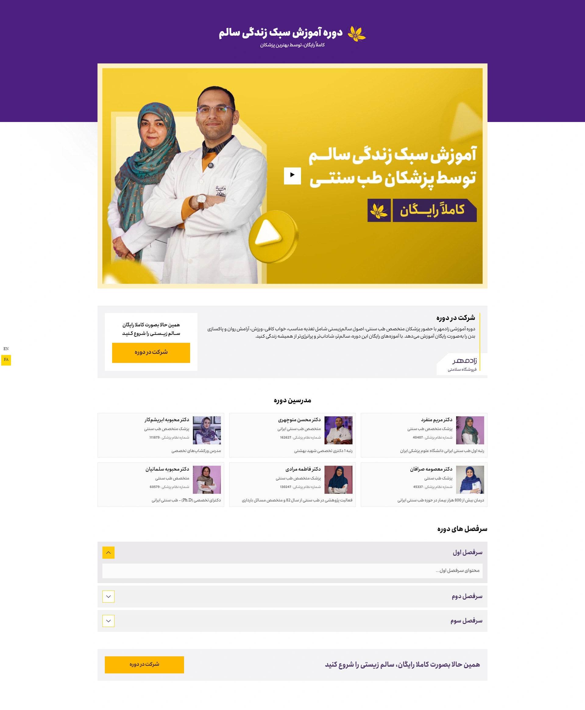
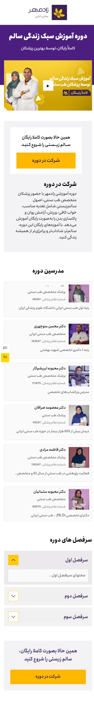

# Healthy Lifestyle Course

A free online course offering education on healthy lifestyle principles by top traditional medicine doctors.

## English Preview

| Desktop | Mobile |
|---------|--------|
|  |  |

## About the Project

This project is a landing page for a free educational course focused on healthy lifestyle practices including:
- Proper nutrition
- Adequate sleep
- Exercise
- Mental wellness
- Body detoxification

The course is presented by specialized traditional medicine physicians with extensive experience in their field.

## Features

- Responsive design optimized for all device sizes
- Video introduction to the course
- Instructor profiles with credentials
- Course chapters and syllabus
- Free registration

## Technologies Used

- HTML5
- CSS3
- JavaScript

## Getting Started

1. Clone the repository
2. Open `index.html` in your browser
3. No additional dependencies required

---

# دوره آموزش سبک زندگی سالم

یک دوره آنلاین رایگان که اصول سبک زندگی سالم را توسط بهترین پزشکان طب سنتی آموزش می‌دهد.

## پیش‌نمایش فارسی

| دسکتاپ | موبایل |
|---------|--------|
|  |  |

## درباره پروژه

این پروژه یک صفحه فرود برای دوره آموزشی رایگان با تمرکز بر شیوه‌های زندگی سالم است که شامل:
- تغذیه مناسب
- خواب کافی
- ورزش
- آرامش روان
- پاکسازی بدن

این دوره توسط پزشکان متخصص طب سنتی با تجربه گسترده در زمینه خود ارائه می‌شود.

## ویژگی‌ها

- طراحی واکنش‌گرا بهینه‌سازی شده برای تمام اندازه‌های دستگاه
- معرفی ویدیویی دوره
- پروفایل مدرسین با مدارک تخصصی
- فصل‌ها و سرفصل‌های دوره
- ثبت‌نام رایگان

## فناوری‌های استفاده شده

- HTML5
- CSS3
- JavaScript

## شروع به کار

1. مخزن را کلون کنید
2. فایل `index.html` را در مرورگر خود باز کنید
3. نیازی به وابستگی‌های اضافی نیست

 